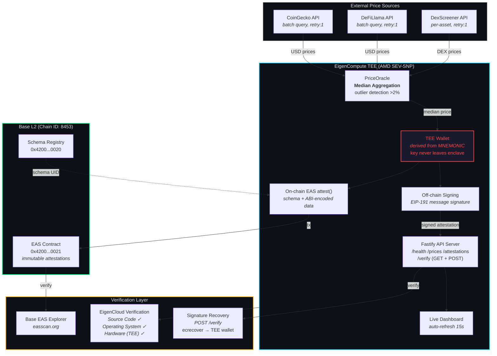
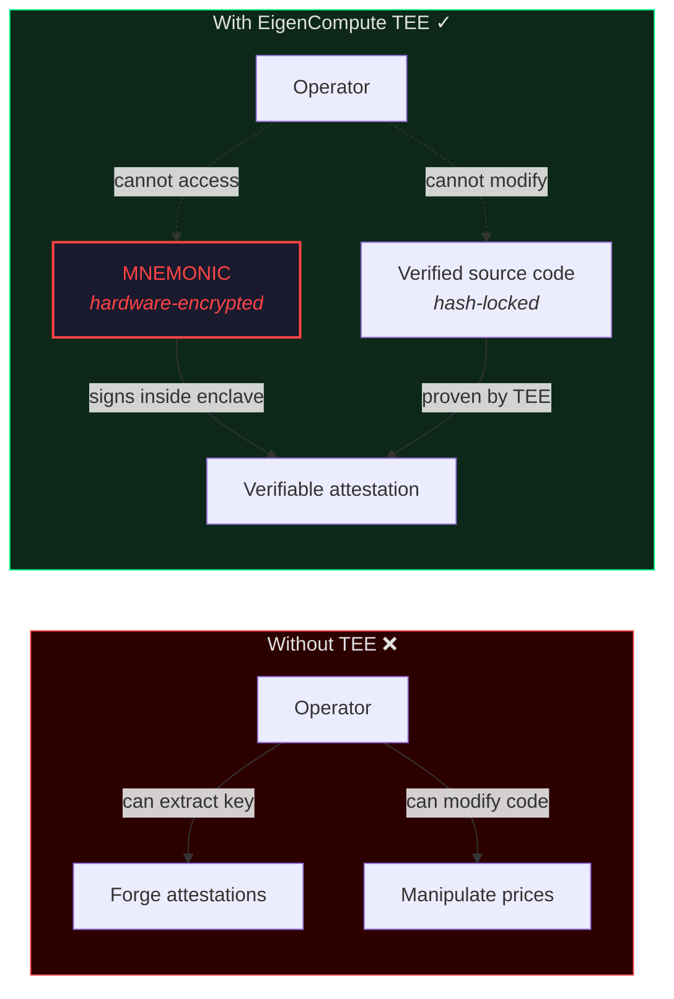
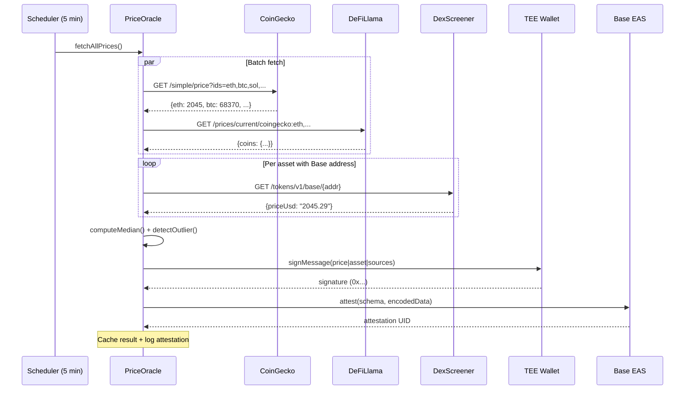

# Verifiable Price Oracle

A TEE-secured cryptocurrency price oracle running on **EigenCompute** that fetches prices from multiple independent APIs, computes outlier-resistant medians, and publishes verifiable attestations — both off-chain (wallet-signed) and on-chain (**EAS on Base**).

Built for the [Synthesis Hackathon](https://synthesis.md) — **Best Use of EigenCompute** track.

## Why TEE?

Traditional oracles require trusting the operator not to manipulate prices. This oracle eliminates that trust assumption:

1. **Code integrity** — EigenCompute's secure enclave cryptographically proves the exact Docker image that ran. The operator cannot modify the price-fetching logic after deployment.
2. **Key isolation** — The signing wallet is derived from `MNEMONIC`, which only exists inside the TEE. The operator cannot extract it to forge attestations.
3. **Dual attestation** — Every price is both wallet-signed (verifiable off-chain) and optionally attested on-chain via EAS on Base.
4. **Outlier detection** — Flags when any source deviates >2% from median, adding confidence metadata.

**The TEE is structurally necessary, not bolted on.** Without it, the oracle is just another centralized price feed.

## Architecture



### Why TEE is Structurally Necessary



### Data Flow (per 5-minute cycle)



## API Endpoints

| Endpoint | Method | Description |
|----------|--------|-------------|
| `/health` | GET | Status, uptime, wallet, balance, schema UID |
| `/prices` | GET | Latest median prices for all tracked assets |
| `/prices/:asset` | GET | Price detail + history + attestation data |
| `/attestations` | GET | Last 50 attestation records (signed + on-chain) |
| `/verify` | GET | Verification schema and instructions |
| `/verify` | POST | Submit `{ message, signature }` to recover signer and confirm TEE origin |

### Example: `GET /prices/ethereum`

```json
{
  "asset": "ethereum",
  "median": 2064.23,
  "sources": [
    { "name": "coingecko", "price": 2064.23, "timestamp": 1711152000000 },
    { "name": "defillama", "price": 2064.22, "timestamp": 1711152000100 },
    { "name": "dexscreener", "price": 2065.19, "timestamp": 1711152000200 }
  ],
  "sourceCount": 3,
  "lowConfidence": false,
  "outlierDetected": false,
  "maxDeviation": 0.05,
  "signature": "0xcee6...1c",
  "signer": "0xf39F...66",
  "encodedData": "0x0000...00",
  "history": [...]
}
```

### Example: `POST /verify`

```bash
curl -X POST /verify -H "Content-Type: application/json" \
  -d '{"message": "PriceOracle|ethereum|206423000000|3|...", "signature": "0xcee6..."}'
```

```json
{
  "valid": true,
  "recoveredSigner": "0xf39F...66",
  "teeWallet": "0xf39F...66",
  "message": "Signature verified — this attestation was signed by the TEE wallet"
}
```

## EAS Attestation Schema

```
string asset, uint256 priceUsd, uint8 sourceCount, uint64 timestamp, string sources
```

- `priceUsd`: 8 decimal places (e.g., `206423000000` = $2,064.23) — Chainlink convention
- `sourceCount`: APIs that returned valid data (0-3)
- `sources`: JSON array of source names

Verify on-chain attestations at [Base EAS Explorer](https://base.easscan.org/).

## Price Sources

| Source | Endpoint | Rate Limit | Retry |
|--------|----------|------------|-------|
| CoinGecko | `api.coingecko.com/api/v3/simple/price` | 10-30 req/min | 1 |
| DeFiLlama | `coins.llama.fi/prices/current` | Generous | 1 |
| DexScreener | `api.dexscreener.com/tokens/v1/base` | Generous | 1 |

All free, no-auth APIs. Uses `Promise.allSettled` for fault tolerance — individual source failures don't block others. Prices attested only when 2+ sources agree.

## Quick Start

### Local Development

```bash
npm install
npm run build

# Read-only mode
MNEMONIC="test test test test test test test test test test test junk" \
ENABLE_ONCHAIN=false \
npm start
```

### Deploy to EigenCompute

```bash
# 1. Install CLI & auth
npm install -g @layr-labs/ecloud-cli
ecloud auth generate --store
ecloud billing subscribe

# 2. Deploy
ecloud compute app deploy

# 3. Fund TEE wallet (check logs for address)
# Send ~0.005 ETH on Base for on-chain attestations

# 4. Monitor
ecloud compute app logs --watch
```

## Configuration

| Variable | Default | Description |
|----------|---------|-------------|
| `MNEMONIC` | — | TEE-provided wallet (auto-injected by EigenCompute) |
| `BASE_RPC_URL` | `https://mainnet.base.org` | Base RPC |
| `CHAIN_ID` | `8453` | 8453 = mainnet, 84532 = sepolia |
| `EAS_SCHEMA_UID` | — | Set after first schema registration |
| `PORT` | `8080` | HTTP server port |
| `PRICE_INTERVAL_MS` | `300000` | Fetch interval (5 min) |
| `ASSETS` | `ethereum,bitcoin` | Comma-separated assets |
| `ENABLE_ONCHAIN` | `true` | Enable EAS on-chain attestations |

## Project Structure

```
src/
├── config.ts        # Environment config, constants, EAS addresses
├── oracle.ts        # 3 API fetchers, retry logic, median, outlier detection
├── attestation.ts   # EAS schema registration, on-chain + off-chain attestation
└── index.ts         # Fastify server, price loop, graceful shutdown
```

## Tech Stack

- **Runtime**: Node.js 22 + TypeScript
- **TEE**: EigenCompute (AMD SEV-SNP)
- **Chain**: Base L2 (EAS attestations)
- **APIs**: CoinGecko, DeFiLlama, DexScreener
- **Web3**: viem
- **Server**: Fastify + CORS
